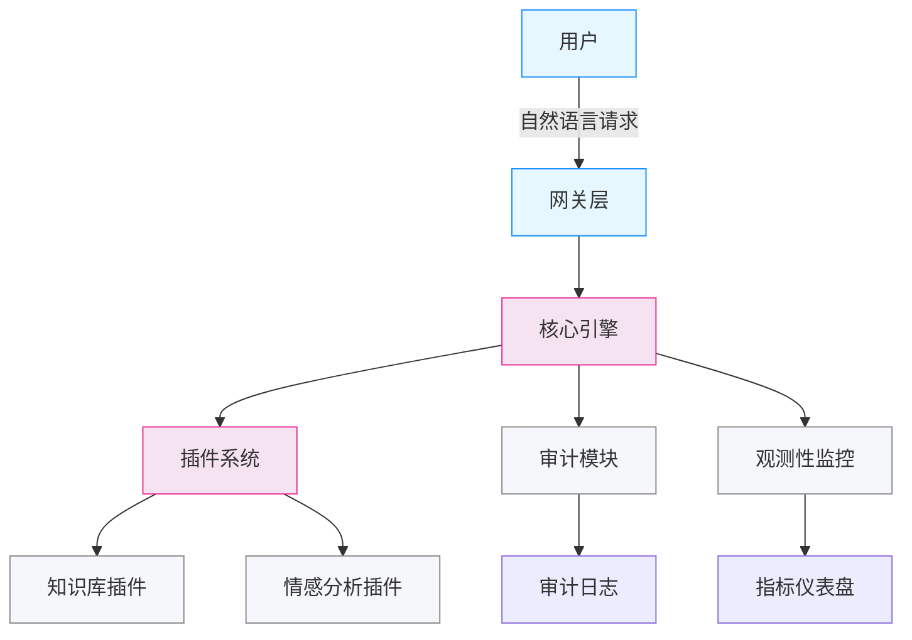

# 场景案例库

## 客服机器人完整案例

### 案例概述

利用 LiuHao AI OS 构建一个智能客服机器人，支持：
- 自然语言理解 (NLU)
- 多轮对话管理
- 插件扩展 (知识库检索、情感分析)
- 安全审计和观测性监控
- 生产环境部署

### 系统架构



### 核心实现

#### 1. 插件开发

```python
from src.plugins.marketplace import Plugin, PluginMetadata, PluginVersion, get_marketplace_store
from src.plugins.sandbox import SandboxExecutionContext, ResourceLimits

# 知识库检索插件
knowledge_metadata = PluginMetadata(
    name="knowledge-base",
    version="2.0.0",
    description="企业知识库检索插件",
    plugin_type="integration",
    author="LiuHao",
    tags=["knowledge", "search", " retrieval"]
)

knowledge_version = PluginVersion(
    version="2.0.0",
    release_notes="支持向量检索",
    upload_url="",
    status="approved"
)

knowledge_plugin = Plugin(
    plugin_id="knowledge-bot-001",
    name="knowledge-base",
    description="企业知识库检索插件",
    metadata=knowledge_metadata,
    current_version=knowledge_version,
    status="published"
)

store = get_marketplace_store()
store.register(knowledge_plugin)
```

#### 2. 主要业务流程

```python
from src.audit import system_event, AuditStore
from src.observability import Span, ObservabilityStore

# 创建审计事件 - 用户咨询
user_query = system_event(
    "user_query", 
    "gateway", 
    severity="low", 
    message="用户咨询: 退款政策",
    request_id="req-12345",
    trace_id="trace-abcde"
)

store = AuditStore()
store.emit(user_query)

# 创建追踪Span
span = Span(
    span_id="span-001",
    trace_id="trace-abcde",
    name="知识库检索",
    kind="server",
    start_time=1000000,
    end_time=2000000,
    attributes={
        "db.operation": "query",
        "db.table": "knowledge_base",
        "error": False
    },
    status="ok"
)

obs_store = ObservabilityStore()
obs_store.emit_span(span)
```

#### 3. 性能监控

```python
from src.performance import create_lru_cache

# 缓存常见查询结果
query_cache = create_lru_cache(max_size=500)

# 缓存命中提升性能
def search_knowledge(query):
    cached = query_cache.get(query)
    if cached:
        return cached  # 缓存命中，直接返回
    
    # 实际查询知识库...
    result = perform_knowledge_search(query)
    
    # 缓存结果 (TTL 30分钟)
    query_cache.put(query, result, ttl=1800)
    return result
```

### 部署与运维

#### Docker 部署

```dockerfile
FROM python:3.11-slim

WORKDIR /app
COPY . .

RUN pip install --no-cache-dir -r requirements.txt

EXPOSE 8080

CMD ["uvicorn", "main:app", "--host", "0.0.0.0", "--port", "8080"]
```

#### 健康检查接口

```python
from fastapi import FastAPI
from src.observability import ObservabilityStore, SpanKind

app = FastAPI()

@app.get("/health")
async def health_check():
    return {"status": "healthy"}

@app.get("/metrics")
async def metrics():
    # 返回 Prometheus 格式指标
    obs_store = ObservabilityStore()
    stats = obs_store.get_stats()
    return stats
```

#### 日志分析

```python
from src.audit import AuditStore, AuditEvent

# 查询错误率
audit_store = AuditStore()
error_events = audit_store.filter_by_severity("high")
error_rate = len(error_events) / max(1, audit_store.get_stats()['total'])

print(f"错误率: {error_rate:.2%}")
```

### 扩展与定制

#### 添加新插件

```python
# 1. 创建插件元数据
metadata = PluginMetadata(
    name="sentiment-analysis",
    version="1.0.0",
    description="情感分析插件",
    plugin_type="extension",
    tags=["ai", "nlp"]
)

# 2. 创建版本
version = PluginVersion(
    version="1.0.0",
    release_notes="初始情感分析功能",
    upload_url="",
    status="pending"
)

# 3. 创建并注册插件
plugin = Plugin(
    plugin_id="sentiment-001",
    name="sentiment-analysis",
    description="情感分析插件",
    metadata=metadata,
    current_version=version,
    status="pending"
)

store = get_marketplace_store()
store.register(plugin)
```

#### 配置自定义

```yaml
# config.yaml
plugin:
  marketplace:
    auto_approve: false
    require_signature: true
    
sandbox:
    default_memory_limit: 52428800  # 50MB
    default_time_limit: 60  # 60秒
    
observability:
    enable_tracing: true
    enable_metrics: true
    sample_rate: 0.1

performance:
    cache:
      max_size: 1000
      default_ttl: 300  # 5分钟
```

### 最佳实践

1. **插件开发**:
   - 保持插件单一职责
   - 使用沙箱隔离，防止影响主系统
   - 完整的版本和变更日志

2. **安全**:
   - 所有事件必须审计
   - 严格的资源限制在沙箱中
   - 依赖冲突提前检测

3. **性能**:
   - 关键路径使用缓存
   - 监控关键指标和告警
   - 定期进行完整性验证

4. **观测性**:
   - 开启分布式铜线 tracing
   - 统一指标命名规范
   - 设置合理的告警阈值